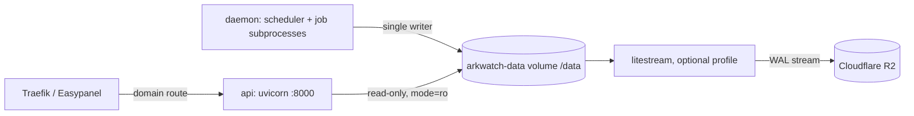

# ark-watch

A personal US macro monitoring engine: automated daily data pipeline over 20+ free public sources → SQLite → Telegram morning brief + alert watcher.

## What it does

- **Collects** 100+ economic series daily (FRED, NY Fed Markets API incl. SOMA per-CUSIP holdings, CME settlements & per-strike options, Treasury/fiscaldata auctions, regional Fed models, Bybit crypto positioning)
- **Computes** signals: Fed net-liquidity decomposition, SOMA maturity walls, options put/call ratios & OI walls, primary-dealer positioning, auction demand percentiles (45 years of history), inflation risk premium, recession triangulation (curve model / SPF survey / Sahm rule)
- **Delivers** a morning brief via Telegram, with a 16-trigger alert watcher running every 60 seconds

## Quickstart

```bash
pip install -r requirements.lock
cp .env.example .env      # add your FRED / FMP / EODHD / Telegram keys
python -m arkwatch daemon # runs the daily schedule
```

Or run single jobs:

```bash
python -m arkwatch harvest   # fetch all series
python -m arkwatch brief     # render the daily brief
python -m arkwatch verify    # data truth gate
```

## Layout

```
arkwatch/    fetchers (data sources) · signals (computation) · qa (jobs) · senders · daemon
config/      series registry + signal thresholds (all YAML, provenance-commented)
tests/       440 offline tests — no network needed
fixtures/    captured API responses for parser tests
```

## Notes

- Keys go in `.env` only (see `.env.example`) — never commit them.
- Some sources are unofficial CDN endpoints; every source is degradable — one going down never breaks the brief.
- This is a personal research tool, **not** investment advice.

GDELT retains the current UTC week in the live database. If Sunday cleanup has eligible rows, it creates a verified temporary snapshot and removes it after post-cleanup checks pass; preview candidates with `python -m arkwatch gdelt-retention`.

## Deployment

One image, two roles, run as an Easypanel **Compose** service from `docker-compose.yml`.



| Service | Command | Limits | Health |
|---|---|---|---|
| `daemon` | `python -m arkwatch daemon` | 1 GB, 60 s stop grace | `python -m arkwatch healthcheck` |
| `api` | `uvicorn arkwatch.server.app:app --workers 1` | 512 MB | `GET /v1/health` via Python urllib |
| `litestream` | `litestream replicate` | 256 MB | profile `litestream`, opt-in |

Everything persistent lives on the `arkwatch-data` volume at `/data`: `arkwatch.db`, daemon state and heartbeat, `logs/` (14 day retention) and `backups/` (nightly at 23:30 WIB, 30 dailies plus 12 monthlies). The image sets `ARKWATCH_DATA_DIR=/data` and symlinks `/app/data` to `/data`, so modules with a hard-coded `data/arkwatch.db` land on the volume too.

```bash
# local smoke test (needs Docker)
GIT_SHA=$(git rev-parse --short HEAD) ARKWATCH_API_KEY=dev docker compose up -d --build
docker compose exec daemon python -m arkwatch healthcheck
docker compose exec daemon python -c "import sqlite3; print(sqlite3.sqlite_version)"

# enable offsite replication once the R2 variables are set
docker compose --profile litestream up -d
```

> [!IMPORTANT]
> Secrets come only from the Easypanel environment (`ARKWATCH_API_KEY` is mandatory, the compose file refuses to start the api without it). Never commit `.env`.

<details><summary>Deploy-time checks</summary>

- [ ] Network: the compose file declares no networks. Confirm how Easypanel attaches the `api` service to Traefik (the Zonelab project uses its own `portfolio_zonelab_default` network) before adding any `networks:` block.
- [ ] Domain record in Cloudflare is **Proxied**; the origin only accepts Cloudflare IPs.
- [ ] `sqlite3.sqlite_version` inside the image prints 3.53.4 (the build fails below 3.51.3).
- [ ] First boot: the healthcheck reports unhealthy until a job has created `/data/arkwatch.db`.
- [ ] Only one `daemon` replica: the OS lock on `/data/daemon.lock` makes a second one exit.

</details>

## License

[MIT](LICENSE)
