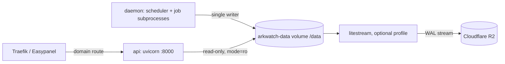

# ark-watch

A personal US macro monitoring engine: automated daily data pipeline over 20+ free public sources → SQLite → Telegram morning brief + alert watcher.

## What it does

- **Collects** 100+ economic series daily (FRED, NY Fed Markets API incl. SOMA per-CUSIP holdings, CME settlements & per-strike options, Treasury/fiscaldata auctions, regional Fed models, Bybit crypto positioning)
- **Computes** signals: Fed net-liquidity decomposition, SOMA maturity walls, options put/call ratios & OI walls, primary-dealer positioning, auction demand percentiles (45 years of history), inflation risk premium, recession triangulation (curve model / SPF survey / Sahm rule)
- **Delivers** a morning brief via Telegram, with a 16-trigger alert watcher running every 60 seconds

## Quickstart

```bash
uv sync --python 3.12   # locked, see uv.lock
cp .env.example .env      # add your FRED / FMP / EODHD / Telegram keys
python -m arkwatch daemon # runs the daily schedule
```

Or run single jobs:

```bash
python -m arkwatch harvest   # fetch all series
python -m arkwatch brief     # render the daily brief
python -m arkwatch verify    # data truth gate
```

## Layout

```
arkwatch/    fetchers (data sources) · signals (computation) · qa (jobs) · senders · daemon
config/      series registry + signal thresholds (all YAML, provenance-commented)
tests/       801 offline tests, zero warnings policy — no network needed
fixtures/    captured API responses for parser tests
```

## Notes

- Keys go in `.env` only (see `.env.example`) — never commit them.
- Some sources are unofficial CDN endpoints; every source is degradable — one going down never breaks the brief.
- Optional news source: set `ARGUS_TOKEN` (and `ARGUS_URL` if not the default) to add headlines from the self-hosted Argus MCP server; unset = SKIPPED.
- This is a personal research tool, **not** investment advice.

GDELT retains the current UTC week in the live database. If Sunday cleanup has eligible rows, it creates a verified temporary snapshot and removes it after post-cleanup checks pass; preview candidates with `python -m arkwatch gdelt-retention`.

## Deployment

One image, two roles, run as an Easypanel **Compose** service from `docker-compose.yml`.



| Service | Command | Limits | Health |
|---|---|---|---|
| `daemon` | `python -m arkwatch daemon` | 1 GB, 60 s stop grace | `python -m arkwatch healthcheck` |
| `api` | `uvicorn arkwatch.server.app:app --workers 1` | 512 MB | `GET /v1/health` via Python urllib |
| `litestream` | `litestream replicate` | 256 MB | profile `litestream`, opt-in |

Everything persistent lives on the `arkwatch-data` volume at `/data`: `arkwatch.db`, daemon state and heartbeat, `logs/` (14 day retention) and `backups/` (nightly at 23:30 WIB, 30 dailies plus 12 monthlies). The image sets `ARKWATCH_DATA_DIR=/data` and symlinks `/app/data` to `/data`, so modules with a hard-coded `data/arkwatch.db` land on the volume too.

Egress: the daemon reaches hosts that block datacenter IPs (Yahoo 429, CFTC 403) through the `warp` SOCKS sidecar via `ARKWATCH_PROXY=socks5h://warp:9091`. Only hosts in `ARKWATCH_PROXY_HOSTS` (default `finance.yahoo.com,publicreporting.cftc.gov`, subdomains included) use it; CME and FRED stay direct because they fail through WARP. The legacy `ARKWATCH_YAHOO_PROXY` is still read as a fallback.

First boot: on a brand-new volume (no `bootstrapped` marker in `daemon_state.json` and an empty `raw_observations`) the daemon runs the data chain once, sequentially (harvest, calendar, instruments sweep, fiscalx, nyfed ops, energy, surprise, cme, f2, fedsurvey, brief; never `send`), then sets the marker.

```bash
# local smoke test (needs Docker)
GIT_SHA=$(git rev-parse --short HEAD) ARKWATCH_API_KEY=dev docker compose up -d --build
docker compose exec daemon python -m arkwatch healthcheck
docker compose exec daemon python -c "import sqlite3; print(sqlite3.sqlite_version)"

# enable offsite replication once the R2 variables are set
docker compose --profile litestream up -d
```

> [!IMPORTANT]
> Secrets come only from the Easypanel environment (`ARKWATCH_API_KEY` is mandatory, the compose file refuses to start the api without it). Never commit `.env`.

<details><summary>Deploy-time checks</summary>

- [ ] Network: the compose file declares no networks. Confirm how Easypanel attaches the `api` service to Traefik (the Zonelab project uses its own `portfolio_zonelab_default` network) before adding any `networks:` block.
- [ ] Domain record in Cloudflare is **Proxied**; the origin only accepts Cloudflare IPs.
- [ ] `sqlite3.sqlite_version` inside the image prints 3.53.4 (the build fails below 3.51.3).
- [ ] First boot: the healthcheck reports unhealthy until a job has created `/data/arkwatch.db`.
- [ ] Only one `daemon` replica: the OS lock on `/data/daemon.lock` makes a second one exit.

</details>

## API

Every `/v1` route except `/v1/health` needs the `x-arkwatch-key` header. Lists return `{items, next_cursor}`, errors `{error, code, detail}`. Export the contract with `python -m arkwatch.server.export_openapi`.

Dashboard reads (the Zonelab web dashboard replaces Telegram delivery):

| Route | Returns |
|---|---|
| `GET /v1/alerts?status=&alert_type=&since=&cursor=&limit=` | alert rows, newest first, every status (limit max 200, `message` is plain text) |
| `GET /v1/alerts/summary` | counts by status and priority for the last 24h and 7d, plus `newest_triggered_at` |
| `GET /v1/briefs?limit=` | brief index: date, regime score, generated_at, chars |
| `GET /v1/briefs/latest`, `GET /v1/briefs/{YYYY-MM-DD}` | one brief with its raw markdown (404 when missing) |
| `GET /v1/graph` | macro system graph: regime, 6 pillars, registry series, instruments, open playbooks, next-7d high/medium events |

The graph uses stored data only. Series are the pillar inputs plus the active registry series of the same block letter (block H has no pillar and is left out). Instruments link to the regime core because no asset to pillar mapping exists in config. Caps: 300 series, 60 scenarios, 50 events, so at most 446 nodes. Cached like `/v1/regime`.

## License

[MIT](LICENSE)

### Free LLM endpoint (optional)

The `ofm` compose service runs [dsh-our-free-model](https://github.com/Ebony-Vinyl/dsh-our-free-model)
(`packages/standalone`, MIT) so news NLP works without a paid key. It is third-party code: the image
is built from a pinned commit (not vendored here), one patch disables its sealed EAC path, and it runs
on its own network (`ofm-net`, shared only with the daemon) with no secrets, a read-only rootfs and
dropped capabilities. Its anonymous free lane presents itself as an OpenCode client, so it can be
throttled or closed by the upstream at any time; only public news text is sent. Host hardening for
the subnet (blocks the VPC, other Docker networks and the cloud metadata address):

```bash
iptables -N OFM-EGRESS
iptables -A OFM-EGRESS -d 172.31.77.0/24 -j RETURN
for n in 169.254.0.0/16 100.64.0.0/10 10.0.0.0/8 172.16.0.0/12 192.168.0.0/16; do iptables -A OFM-EGRESS -d $n -j DROP; done
iptables -A OFM-EGRESS -j RETURN
iptables -I DOCKER-USER 1 -s 172.31.77.0/24 -j OFM-EGRESS && netfilter-persistent save
```
